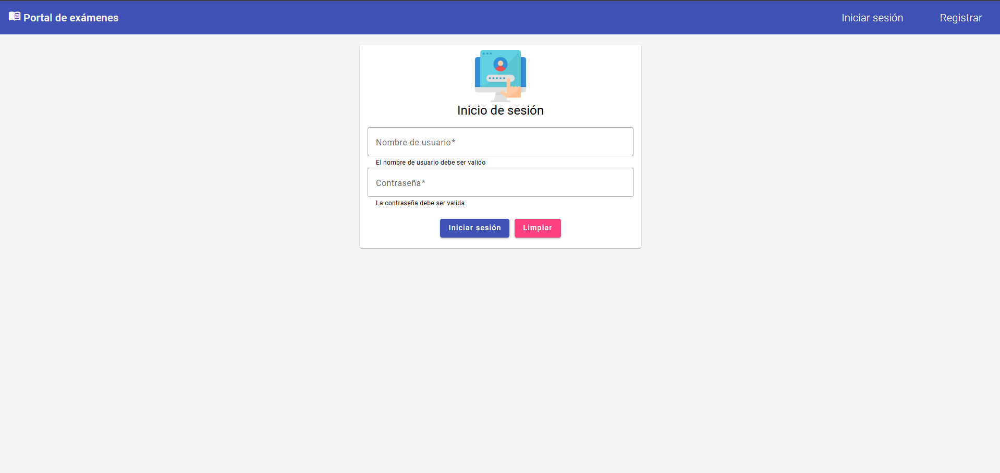
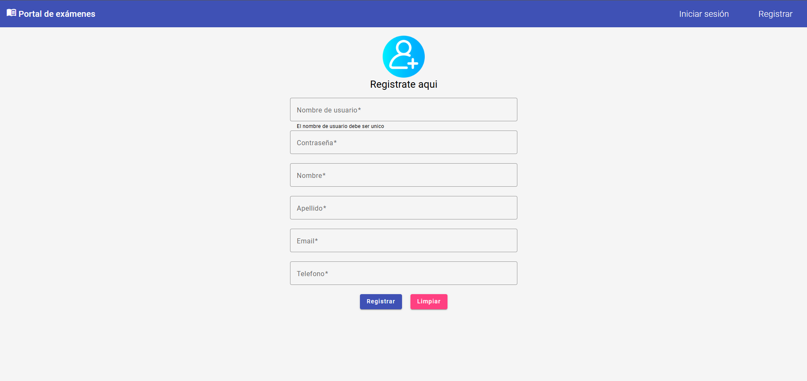
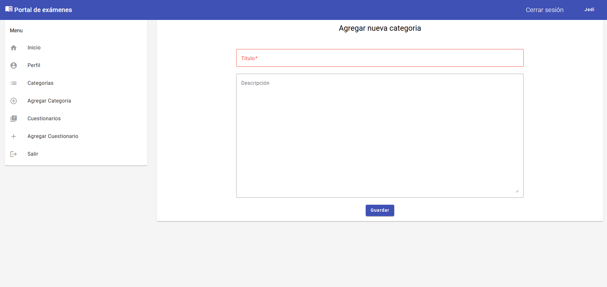

# Sistema Exámenes

Este es un sistema para gestionar exámenes en línea.

## Descripción

El sistema permite a los administradores crear categorias para los exámenes, agregar preguntas y respuestas.
Los usuarios pueden realizar los exámenes y obtener sus resultados.

## Tecnologías utilizadas

- **Backend**: Spring Boot
- **Frontend**: Angular
- **Base de datos**: MySQL

## Instalación

### Backend

1. Clonar el repositorio:  
   `git clone https://github.com/tu-usuario/sistema-examenes.git`
2. Entrar en el directorio del backend:  
   `cd sistema-examenes/sistema-examenes-backend`
3. Compilar el proyecto:  
   `mvn clean install`
4. Ejecutar el servidor:  
   `mvn spring-boot:run`

### Frontend

1. Clonar el repositorio:  
   `git clone https://github.com/tu-usuario/sistema-examenes.git`
2. Entrar en el directorio del frontend:  
   `cd sistema-examenes/sistema-examenes-frontend`
3. Instalar dependencias:  
   `npm install`
4. Ejecutar la aplicación:  
   `ng serve`
## Capturas
### Login

### Registro

### Administrador

